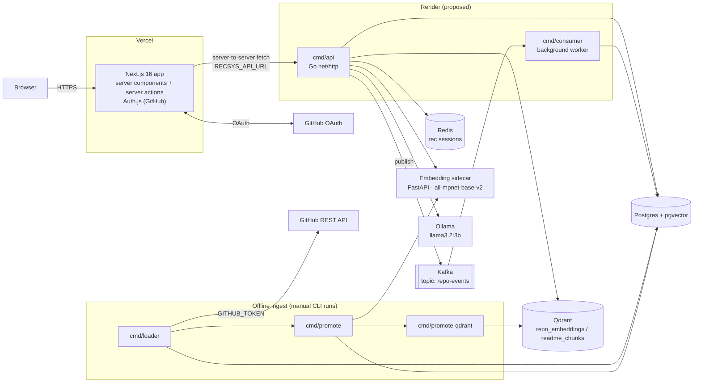

# Architecture — recsys-go

Derived from the code at commit `e7af4a9`. Anything not backed by a file in the repo is marked **(proposed)** or **(inferred)**.

---

## Open Questions & Gaps

Read this first. These are things the code does not settle, or that block an accurate production deploy.

### Deployment config that does not exist
1. **No `render.yaml`, `Dockerfile`, `Procfile`, or CI config** anywhere in the repo. Every Render setting below is **proposed and unverified**.
2. **No `vercel.json`**. The Vercel settings below assume defaults, with Root Directory = `frontend`.
3. **No live deployment URLs** in any config, README, or env file.
4. ~~**Port mismatch.**~~ **Resolved:** the API now listens on `PORT` (Render-injected), falling back to `API_PORT`, then `8081`.
5. ~~**No health-check endpoint.**~~ **Resolved:** `GET /healthz` returns `200 {"status":"ok"}` and checks no dependencies. It is not wired into any Render config yet.

### Backing services the code can't reach in a typical hosted setup
6. ~~**Kafka has no TLS/SASL.**~~ **Resolved:** added optional `KAFKA_TLS` and `KAFKA_SASL_MECHANISM` (PLAIN, SCRAM-SHA-256, SCRAM-SHA-512) with username and password, applied to both producer and consumer. Render still has no managed Kafka, so a provider must be chosen.
7. ~~**Qdrant sends no API key.**~~ **Resolved:** added optional `QDRANT_API_KEY`, sent as the `api-key` header on every Qdrant request. TLS comes from an `https://` `QDRANT_URL`.
8. ~~**Redis has no password/TLS.**~~ **Resolved:** added optional `REDIS_USERNAME`, `REDIS_PASSWORD` and `REDIS_TLS`.

Items 6–8 are code-level support only. None of it has been tested against a live hosted provider.
9. **Embedding sidecar and Ollama.** `all-mpnet-base-v2` (torch) and `llama3.2:3b` are memory-heavy and unlikely to fit Render's free or starter instances. Where they run is undecided. The sidecar has **no `requirements.txt`**; package versions are known only from the local venv.
10. **Manual infra setup.** Nothing in the code creates the Qdrant collections (`repo_embeddings`, `readme_chunks`) or the Kafka topic (`repo-events`). Collection params are **assumed**: 768 dims, Cosine distance.
11. **Migration tool unknown.** No tool is referenced anywhere. The filenames follow the golang-migrate convention (**assumed**). There is no `000007_*` migration.

### Correctness and security gaps found in the code
12. **The API is unauthenticated.** Anyone who knows the Render URL can call `POST /v1/auth/sync` or `POST /v1/events` with any `user_id`. Identity is only enforced inside the Next.js server actions.
13. ~~**Bug: `cmd/promote` never copies `stars`.**~~ **Resolved:** `cmd/promote` now copies `stars` from staging. Migration `000016` restores zeroed rows from `repo_ingest_staging`, where the source value is kept. Covered by `cmd/promote/main_test.go`.
14. ~~**Consumer "retry" can lose events.**~~ **Resolved:** a transient insert error is now retried in place with capped exponential backoff (200ms → 30s, no attempt limit), and the next message isn't fetched until it succeeds. Covered by `cmd/consumer/main_test.go`. Trade-off: if a persistent error is misclassified as transient, the consumer stalls, visible via the attempt count in the log, instead of dropping events.
15. **Events partitions end at 2027-12.** Inserts fail from 2028-01-01; there is no job that rolls partitions forward.
16. **GitHub OAuth apps allow one callback URL.** Sign-in won't work on Vercel preview deployments unless you set up a separate OAuth app or proxy.
17. **Unknown in production:** how the one-off ingest CLIs (`loader`, `promote`, `promote-qdrant`) run, and whether free-tier cold starts (Render spin-down) are acceptable behind Vercel function timeouts.

---

## System Overview

The browser **never** calls the Go API. All API traffic comes from the Next.js server, which is why no CORS is configured.

---

## Components

| Path | What it does |
|---|---|
| `cmd/api` | HTTP API with 7 `/v1` routes plus `GET /healthz`, all handlers in `main.go`. Reads Postgres, Redis, Qdrant, the sidecar, and Ollama; publishes events to Kafka. |
| `cmd/consumer` | Kafka consumer (group `events-consumer`). Inserts events idempotently, retrying transient DB errors in place before fetching the next message, then recomputes the user's embedding. |
| `cmd/loader` | Fetches repos and READMEs from the GitHub API (4 topic/language categories × 150 repos). Chunks READMEs on `## ` headings into staging tables. |
| `cmd/promote` | "Sweep 1": embeds staged repos and chunks via the sidecar, then writes `items`, `item_embeddings`, and `readme_chunks` (pgvector). |
| `cmd/promote-qdrant` | "Sweep 2": copies vectors from Postgres into the Qdrant collections in batches of 50. |
| `cmd/producer-test`, `cmd/test-candidates` | Dev smoke scripts, hardcoded to user 1. |
| `internal/config` | The only env reader. Memoized `Load()`, loads `.env` from the CWD, falls back to local defaults. |
| `internal/store` | Every SQL and Qdrant/sidecar/Ollama call: ranking, search, browse, events, and user embeddings. |
| `internal/session` | Redis snapshot sessions (`rec_session:<uuid>`, 10-min TTL) and the base64 cursor. |
| `internal/events` | Synchronous Kafka producer (`RequireAll`, hash-keyed by `user_id`). |
| `internal/domain` | `RepoEvent` and its validation. |
| `internal/api`, `internal/vector` | Empty (`.gitkeep` only). |
| `migrations/` | Up/down SQL, `000001`–`000016`. |
| `api/openapi.yaml` | OpenAPI 3.0.3 contract, currently in sync with the handlers. |
| `embedding_sidecar/main.py` | FastAPI `POST /embed` that returns a 768-dim vector. |
| `frontend/` | Next.js 16 App Router, React 19, next-auth v5 beta. |
| `frontend/lib/api.ts` | Typed server-only API client. `ApiError` status `0` means the API is unreachable. |
| `frontend/app/actions.ts` | Server actions; the only path from client components to the API. `user_id` always comes from the session. |

### Frontend routes
| Route | Purpose |
|---|---|
| `/` | Browse the catalog (stars desc), with a `?language=` filter |
| `/items/[item_id]` | Repo detail, README chunks, and event buttons |
| `/recommendations` | Personalized feed; shows popular items with a notice on cold start |
| `/search` | Grounded README search |
| `/api/auth/*` | Auth.js handlers |

### Data model (Postgres)
- `users(id, external_id UNIQUE, active_embedding_id)`
- `items(id, title, owner, description, language, topics[], stars, github_id UNIQUE, active_embedding_id)`
- `models(id, version, purpose ∈ {behavioral, transcript_search}, embedding_dim)`, seeded with `mpnet-v1` ×2
- `user_embeddings`, `item_embeddings`: `vector(768)`; `user_embeddings` is unique on `(user_id, model_id)`
- `readme_chunks(item_id, model_id, chunk_text, section_heading, chunk_index, embedding)`
- `events`: partitioned monthly on `created_at`, unique on `(event_id, created_at)`
- `repo_ingest_staging`, `readme_chunk_staging`: ingest staging with an `embedded` flag

---

## Request Data Flows

**1. Sign-in**
Browser → Auth.js GitHub OAuth → `jwt` callback (fresh sign-in only) → `POST /v1/auth/sync {external_id: "github:<numeric id>"}` → upsert into `users` → `recsysUserId` stored in the JWT. If sync fails, sign-in fails.

**2. Engagement event (typical write)**
1. Button → server action `recordEvent(itemID, type)`, which reads `user_id` from the session.
2. `POST /v1/events` → validate, generate a UUID if needed → FK existence check (404 if missing).
3. Publish to Kafka with key = `user_id` and acks = all → return **202**.
4. Consumer → `InsertEvent` (`ON CONFLICT DO NOTHING`) → commit → `RecomputeUserEmbedding`. The embedding is a weighted average of item embeddings: starred 3, clicked_readme 2, viewed 1.

**3. Recommendations (typical read)**
1. `/recommendations` server component → `GET /v1/recommendations/{user_id}`.
2. Load the user's active embedding. If there is none, return `fallback: cold_start`.
3. Qdrant `repo_embeddings` search, top 150 → drop items the user already has events for → load title, description, and stars in one query.
4. Score = `0.8 × similarity + 0.2 × stars/maxStars` → keep the top 100 → store in Redis for 10 minutes → return page 1 (20 items) and a cursor.
5. "Load more" → server action → same endpoint with `cursor`. It pages the frozen snapshot; an expired cursor silently starts a fresh one.

**4. Grounded search**
`POST /v1/recommendations/search` → sidecar embeds the query → Qdrant `readme_chunks` top 5 → Postgres join for chunk text and repo → keep chunks with score ≥ 0.5 → if none, return `no_results` (the LLM is never called) → otherwise Ollama writes an answer from those chunks only → `grounded`. Any dependency failure returns **200** with `retrieval_error`.

**5. Browse**
`GET /v1/items` uses keyset pagination on `(stars DESC, id DESC)`. The cursor embeds the language filter, so a mismatched filter returns 400.

---

## Deployment Topology

### Vercel — frontend
| Setting | Value |
|---|---|
| Root Directory | `frontend` |
| Framework preset | Next.js |
| Install / Build | `npm ci` / `npm run build` (defaults) |
| Node.js version | 22.x (Next 16 requires ≥ 20.9; 22 is used locally) |
| Output | Default `.next` (don't use the `-p 3001` flag from `npm start`) |
| Env vars | `AUTH_SECRET`, `AUTH_GITHUB_ID`, `AUTH_GITHUB_SECRET`, `RECSYS_API_URL` (the Render API's public URL, **not** `NEXT_PUBLIC_`) |
| External | GitHub OAuth app callback: `https://<vercel-domain>/api/auth/callback/github` |

If `RECSYS_API_URL` is unset, the app silently falls back to `http://localhost:8081`, and every page renders the "Backend unavailable" state.

### Render — backend (proposed; no config in repo)
| Service | Render type | Build command | Start command | Env vars |
|---|---|---|---|---|
| `recsys-api` | Web Service (Go) | `go build -o bin/api ./cmd/api` | `./bin/api` | `DATABASE_URL`, `REDIS_ADDR`, `KAFKA_BROKERS`, `QDRANT_URL`, `EMBED_SIDECAR_URL`, `OLLAMA_URL`, plus provider auth as needed (`QDRANT_API_KEY`, `REDIS_PASSWORD`/`REDIS_TLS`, `KAFKA_TLS`/`KAFKA_SASL_*`). `PORT` is injected by Render; don't set `API_PORT`. |
| `recsys-consumer` | Background Worker (not on the free tier) | `go build -o bin/consumer ./cmd/consumer` | `./bin/consumer` | `DATABASE_URL`, `KAFKA_BROKERS`, plus `KAFKA_TLS`/`KAFKA_SASL_*` for hosted Kafka |
| Postgres | Render Postgres (supports pgvector — **verify on plan**) | — | — | Run migrations `000001`–`000016` before first start |
| Redis | Render Key Value, internal address | — | — | — |
| Ingest CLIs | One-off Job or local run against the prod DB | `go build ./cmd/loader ./cmd/promote ./cmd/promote-qdrant` | run in order | `GITHUB_TOKEN`, plus those binaries' vars |
| Sidecar, Qdrant, Ollama | Undecided; see Open Questions 6–9 | — | — | — |

**Health check:** set the `recsys-api` Health Check Path to `/healthz` (`healthCheckPath: /healthz` in a future `render.yaml`). It returns `200 {"status":"ok"}` as soon as the process serves HTTP and checks no dependencies, so a Postgres, Kafka, Qdrant or Redis outage won't make Render restart-loop the API. The consumer is a background worker and has no HTTP health check.

`go.mod` pins `go 1.26.5`. If Render's Go image is older, `GOTOOLCHAIN=auto` should download the right toolchain (**verify**). A Dockerfile would remove that uncertainty.

---

## Key Architectural Decisions

| Decision | Why | Source |
|---|---|---|
| API → Kafka → consumer, instead of writing events directly | The consumer recomputes the user embedding after insert; a direct write would leave recommendations stale | `internal/events/producer.go` comment |
| `202 Accepted` for events | The row isn't readable yet when the API responds | handler comment |
| FK pre-check before publishing | A bad id would otherwise be a permanent consumer failure behind a false 202 | handler comment |
| Kafka key = `user_id`, acks = all, sync writes | Keeps each user's events ordered; a 202 means the event is durably queued | producer comment |
| Dedupe key `(event_id, occurred_at)` | Postgres requires the partition key in any unique constraint | `store/events.go` comment |
| Redis snapshot cursor for recs, keyset cursor for browse | Rankings are computed per request, so they need freezing; star order is stored, so it can page off an index | `store/browse_cursor.go`, OpenAPI |
| Qdrant for ANN, pgvector as the vector source of truth | ANN search offloaded to Qdrant; Postgres keeps canonical vectors, and sweep 2 copies them over | **inferred** from `promote-qdrant` |
| Two-sweep ingest with staging tables | Resumable and idempotent ingest (`embedded` flags, `ON CONFLICT (github_id)`) | loader/promote code, commit history |
| Grounded RAG with a 0.5 threshold, `retrieval_error` returned as 200 | Never answer without grounding; keep "nothing matched" distinct from "couldn't search" | `store/search.go`, `SearchPanel.tsx` |
| Browser never calls the API | Keeps `RECSYS_API_URL` server-side, needs no CORS, and stops clients spoofing `user_id` | `lib/api.ts`, `actions.ts` comments |
| Versioned embeddings (`models` table, `active_embedding_id`) | Lets models be swapped without rewriting rows | **inferred** from schema and commit `6220330` |
| Stdlib `net/http` and `database/sql` with raw SQL, no framework or ORM | Minimal dependencies; Go 1.22+ method routing is enough | **inferred** |
| Local models (sentence-transformers, Ollama) | Zero API cost for local development | **inferred**; this is also the main blocker for hosting |
